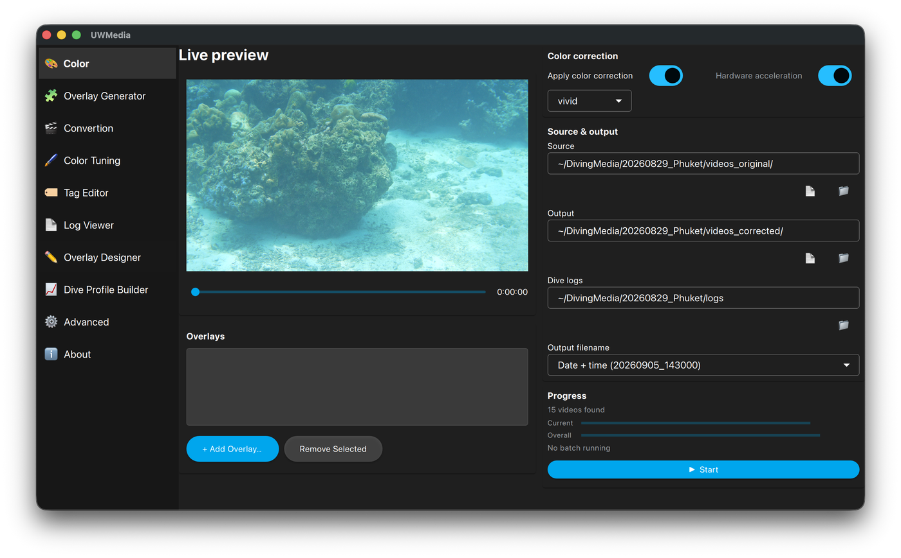
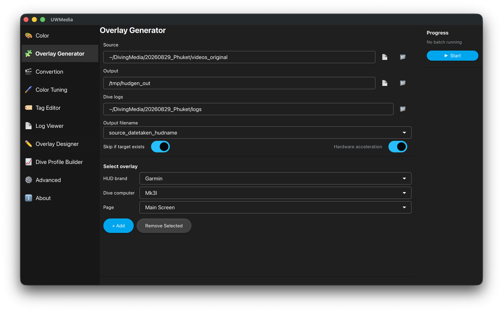
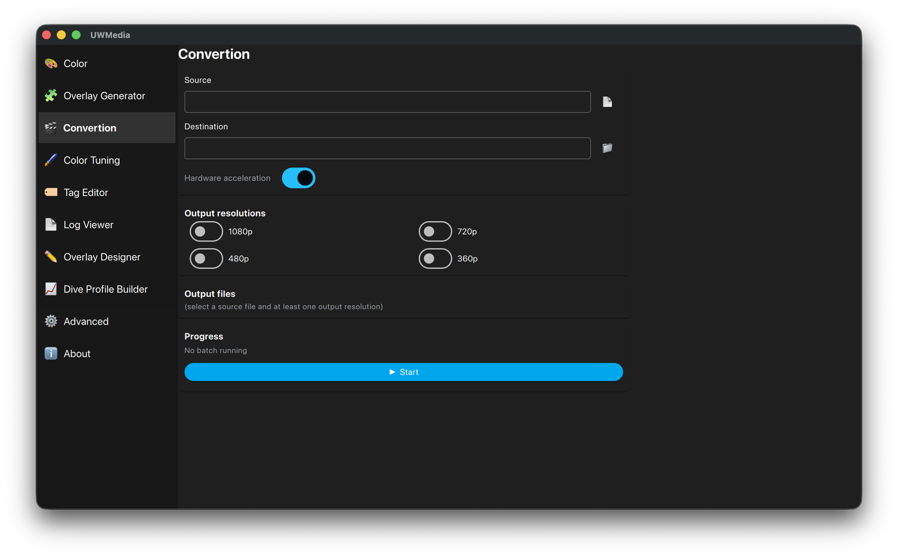
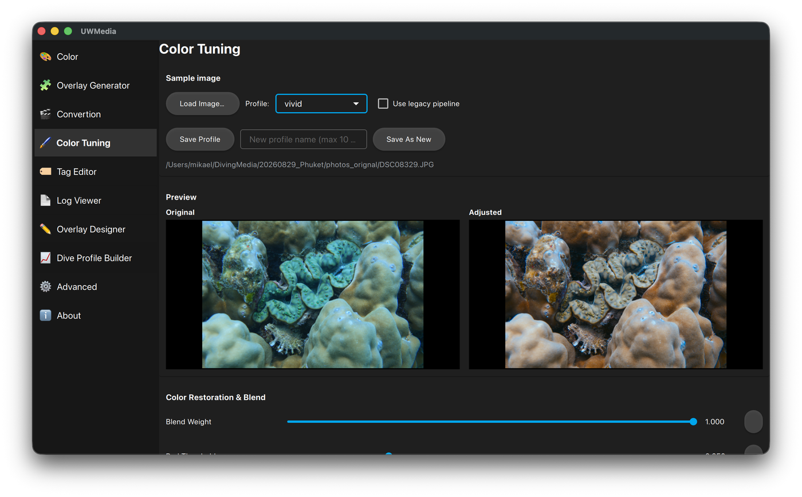
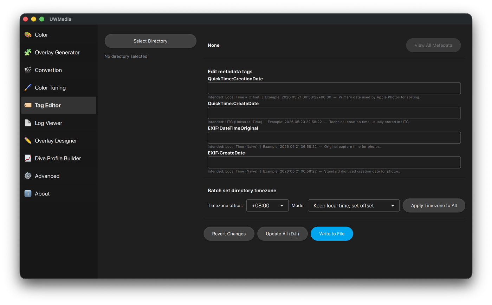
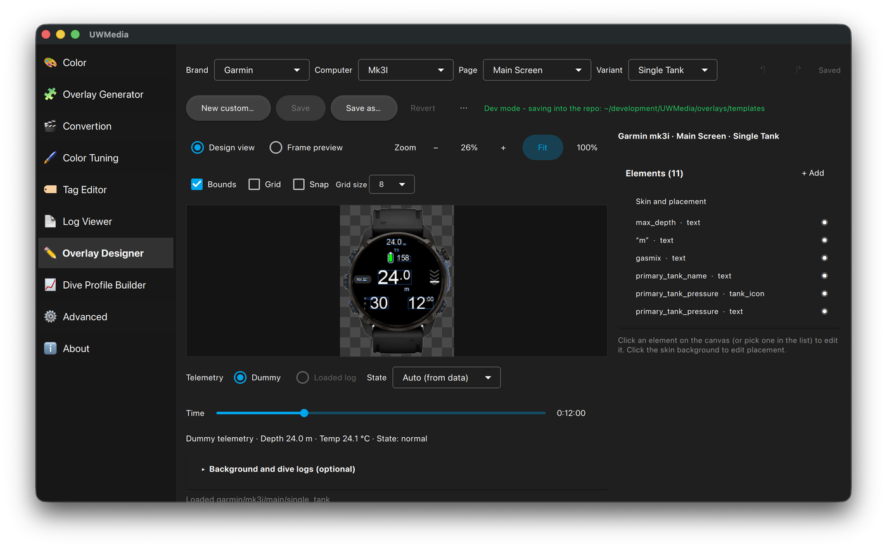

# UWMedia (Underwater Media Processor)

<p align="center">
  <a href="https://skillicons.dev">
    
  </a>
</p>

<p align="center">
      
      
    </p>


UWMedia is a tool for processing underwater videos and photos. It can use telemetry information from dive computers to generate an overlay on photos and videos. There is also support for color correction so you don't have to do every photo / video one by one.

When i started the project 2025 I wanted the overlay data from the dive computer on my videos. At the same time I added a basic color correction but it wasn't very good.
Since then I started to use Gemini and Antigravity to be able to test alternative solutions and get a better color correction.

Example of Photo before and after


Photo with Telemetry data (old overlay)


## [Example (YouTube)](https://youtu.be/8r8_4H4iOMg) (will be updated)

## Key Features

- **Batch Processing**: Process entire directories of videos and photos in one command.
- **Fast 3D LUT Color Pipeline**: Dynamic 3D LUT (`.cube`) generation from profile settings, executing color correction natively in FFmpeg to bypass Python overhead and speed up vs processing frame by frame.
- **Advanced Color Correction**: Underwater color restoration with custom profiles (vivid, subtle, default) saved in `color.yaml`.
- **Telemetry Overlay (HUD)**: Synchronize dive logs from Garmin (.FIT), Subsurface (.XML), and Shearwater (.UDDF) to create dynamic telemetry overlays.
- **Batch Telemetry Overlays (`--render-video-log`)**: Automatically generate matching black-background overlay videos/photos for all raw files in a folder, preserving creation timestamps and duration.
- **Metadata Integrity**: Preserves original camera metadata (QuickTime, DJI, Sony) and injects correct timezone/location information.
- **Dynamic Naming**: Automatically rename files based on the "Date Taken" metadata (`YYYYMMDD_HHMMSS`).
- **Overlay Templates & Designer**: Built-in overlay templates per dive computer (Garmin x50i/mk3i, Shearwater Perdix 2/3, Petrel, Peregrine, Teric, Tern, generic) with live state badges and colour rules, plus a full designer to modify them or build your own from any background image.
- **Log-to-Video Generation**: Create HEVC telemetry-only videos directly from dive logs on a black background, with size automatically adjusted to layout dimensions.
- **FCPXML Support**: Automatically generates `.xml` files for rendered telemetry videos for instant import into Final Cut Pro.
- **Layout Validation**: Automatic verification of HUD layouts against loaded dive logs to prevent errors during processing.

### Workflow (how I do)
- **Run Color Correction**: Run color correction for all videos and photos
- **Telemetry Creation**: For each one of the corrected videos I generate the matching telemetry overlay, multiple versions.
- **Import to Video Editor**: I use Final Cut Pro and import all overlays and videos in to one folder.
- **Synchronized Clip**: In FCP it I create a sync clip for each video that I want to use and select the overlay that I want for just that video.
- **Create the Video**: Create the video as normal but since overlay is separated to the overlay it is easier to make adjustments like stabilization.

Maybe I should do a Video of the workflow too but sometime in the future.

## Installation

### System Requirements
1. **Python 3.10+**
2. **FFmpeg**: Must be in your system PATH.
3. **ExifTool**: Must be in your system PATH.

### Setup
```bash
# Clone the repository
git clone https://github.com/MickeMannen/UWMedia.git
cd UWMedia

# Install dependencies
pip install -r requirements.txt
```

Alternative if you want to use a packaged app - download from the [Releases](../../releases) page (Windows/macOS/Linux). Releases are created and attached by hand, not automatically on every push, so check that a macOS download is described as signed/notarized before assuming it'll open without a Gatekeeper warning.

On macOS, two separate downloads are built (see [Building the App](#building-the-app)):
- **`UWMedia-*.dmg`** - plain GUI app, drag to `/Applications`. Recommended for most users.
- **`UWMedia-Terminal-*.pkg`** - adds a scriptable `uwmedia` terminal command alongside the same GUI; installs to `/Library` instead of `/Applications`. Use this if you want to run batch/scripted processing from the command line.

Windows and Linux only ship the CLI + GUI hybrid build, since neither has the same "wrong folder for a normal app" mismatch a macOS console app has.

### Building the App

UWMedia is packaged with [Briefcase](https://briefcase.readthedocs.io/) as two apps sharing one codebase (see `pyproject.toml`): `uwmedia` (plain GUI) and `uwmedia-terminal` (CLI + GUI hybrid). Use the `build.sh` (macOS), `build.bat`, or `build.ps1` (Windows) script; each automatically uses the project's virtual environment:

```bash
# Build and package for your platform
./build.sh          # macOS - builds both uwmedia (.dmg) and uwmedia-terminal (.pkg)
build.bat           # Windows - builds uwmedia-terminal (.msi) only
```

This runs `briefcase build` then `briefcase package`, producing installers under `dist/`. You can also drive Briefcase directly - omit `-a` to build every app, or target one specifically:

```bash
briefcase dev -a uwmedia-terminal              # run from source, GUI or CLI
briefcase build macOS                          # build every app's bundle
briefcase package macOS --adhoc-sign           # package every app for distribution
briefcase package macOS -a uwmedia --adhoc-sign   # ...or just the plain GUI app
```

## Usage

### Graphical User Interface

UWMedia is a single desktop app (built with [PySide6](https://doc.qt.io/qtforpython/)/Qt Quick) that bundles the CLI's batch-processing controls together with interactive design and tuning tools. Each page is one entry in the sidebar.

```bash
python -m uwmedia      # from source
briefcase dev          # via Briefcase
```

- **Color**: batch colour correction. Pick a profile, point it at the source, output and dive-log folders, optionally add one or more overlays and drag them into place on the live preview, choose the output filename pattern and press Start. Progress is shown per file and overall.

  <p align="center">
    
  </p>

- **Overlay Generator**: batch-generate telemetry-only overlay videos and photos (black background, sized to the template) for every file in a folder, each matched to its dive by time. Pick brand → dive computer → page and queue as many overlays as you want rendered per file.

  <p align="center">
    
  </p>

- **Convertion**: re-encode a video to one or more resolutions (1080p, 720p, 480p, 360p) with hardware acceleration; the resulting file names are listed before you start.

  <p align="center">
    
  </p>

- **Color Tuning**: side-by-side **Original**/**Adjusted** preview with sliders for restoration weights, white balance, exposure, OKLCh hue shifts, sharpness, and darkness. Save adjustments back to an existing profile or as a new one - saved to your user profile (`color.yaml` in the app's data directory), so bundled defaults are never overwritten.

  <p align="center">
    
  </p>

- **Tag Editor**: batch-view and edit EXIF/QuickTime date/timezone tags across a directory, with automatic DJI timestamp correction, a batch timezone tool and a full raw-metadata viewer.

  <p align="center">
    
  </p>

- **Log Viewer**: browse the parsed dive logs (Garmin FIT, Shearwater UDDF, Subsurface) dive by dive and waypoint by waypoint, to check what the overlays will see.

- **Overlay Designer**: edit any built-in overlay template or build your own. The canvas renders a synthetic dive by default (no video or log needed), with a Design view at native pixels and a Frame preview of the full 1920x1080 composite. See [Designing your own overlay](#designing-your-own-overlay).

  <p align="center">
    
  </p>

- **Dive Profile Builder**: plan a dive (gases and waypoints, simulated with a Bühlmann model) and write it out as a UDDF log - handy for checking an overlay without a real dive.
- **Advanced**: folders for your own templates and colour profiles, and the ffmpeg/exiftool paths.

Please share if you make a fancy overlay!

### Designing your own overlay

The Overlay Designer edits templates directly:

- Pick a built-in template (brand → dive computer → page) and modify it: drag fields on the canvas (or nudge with the arrow keys / type X and Y), add telemetry fields, custom labels, the state badge, tank icons or the depth graph, and set font, size, colour, alignment and outline per field. The canvas renders a synthetic dive by default, so no video or dive log is needed; both stay optional.
- Built-in templates are read-only in the installed app. **Save as…** copies the page into one you own - under the same computer (so it keeps that computer's colour and warning rules), another computer, or a new *Custom* computer.
- **New custom…** starts an empty page from your own background image (a dive-computer screenshot, a HUD graphic, a transparent PNG) or a plain rounded shape, then you place fields on it.
- Your templates live in the app's data folder (`~/Library/Application Support/UWMedia/templates/<brand>/<computer>/<page>/normal.json` + `normal.png` on macOS; the equivalent per-user folder on Windows/Linux, overridable under Advanced). They appear in the Overlay Generator and in Color's *Add Overlay* picker immediately, marked "· yours", and the CLI renders them with `--layout <that folder>/normal.json`.
- Running from a source checkout, saves go straight into the repo's `overlays/templates/` (that is how the built-in templates are authored); set `UWMEDIA_TEMPLATES_TARGET=user` to force the per-user folder instead.

### Command Line Interface (CLI)

The CLI is the primary way to process media batches.

```bash
# Basic color correction (utilizing the fast 3D LUT pipeline)
python cli_main.py ./raw_videos/ ./output/ --color

# Complete processing with dive logs and telemetry overlay
python cli_main.py ./raw/ ./out/ --logs ./dive_logs/ --layout skins/perdix.zip --color

# Generate telemetry video directly from a log file (size matches layout dimensions)
python cli_main.py --render-log dive_log.fit --layout perdix_layout.json

# Generate telemetry video directly from a log file, limiting to the first 100 waypoints (useful for testing)
python cli_main.py --render-log dive_log.fit 100 --layout perdix_layout.json

# Batch generate telemetry overlay files for all photos/videos in a folder (matched to log times)
python cli_main.py ./raw/ ./out/ --render-video-log --layout skins/perdix.zip --logs ./dive_logs/
```

#### Configuration files
- color.yaml
- hud_rules.json
- config.yaml

#### Key Arguments:
- `--color`: Apply underwater color correction. Takes one argument - color profile - if not added default is used.
- `--logs <dir>`: Path to directory containing `.uddf`, `.fit`, or subsurface `.xml` logs (Make sure you don't have duplicates).
- `--layout <zip|json>`: Use a ZIP package or JSON layout for telemetry overlay. Automatically enables overlay.
- `--render-log <file> [num_waypoints]`: Create a telemetry-only HEVC video from a specific dive log (requires `--layout`). You can optionally specify a second argument for the number of waypoints to render (e.g., `100`) to limit processing time during testing.
- `--filename-format <template>`: Custom naming (e.g., `"%Y%m%d_%H%M%S_Bali"`).
- `--render-video-log`: Generate a telemetry-only video based on files in input directory
- `--create-config`: Scan the log directory and generate a config file for TANK names
- `--debug`: Show verbose FFmpeg output for troubleshooting.


## Technical Highlights

### 3D LUT Color Correction
For standalone video color correction, UWMedia generates a 3D Lookup Table (`.cube` file) dynamically from the parameter configurations in `color.yaml` and executes the color grading natively inside FFmpeg using the `lut3d` filter. This bypasses the Python interpreter's frame-by-frame decoding and matrix math, achieving up to 10x speedups with high rendering throughput.

### Threaded Python Processing
When drawing telemetry layouts onto videos, the application employs a 3-thread concurrent pipeline (decoding, processing/drawing, and encoding running in parallel) with native BGR in-place frame processing to prevent redundant color-space conversions and maximize GUI/CPU core utilization.

### Metadata Handling
Powered by **PyExifTool**, UWMedia ensures that your processed files are not "blank" videos. It copies all vendor-specific tags and correctly handles the complex timezone offsets found in DJI, Sony, and GoPro files. It also injects location, timezone, and matched dive log dates directly into generated overlays.


### Layout Validation
To ensure reliability during batch processing, UWMedia validates HUD layouts against the actual dive telemetry before starting the render. It checks for:
- **Field Existence**: Verifies that requested telemetry fields (depth, temp, etc.) exist in the data model.
- **Tank Serial Matching**: Alerts users if the layout expects tank data (e.g., from a Garmin transmitter) that isn't present in the provided log files.
- **JSON Integrity**: Ensures layouts are correctly formatted and skin assets are accessible.

## License

[MIT License](LICENSE)

## Credits
- Color Algorithm: [bornfree](https://github.com/bornfree) - This is not used anymore but gave me the idea!
- Metadata: [ExifTool by Phil Harvey](https://exiftool.org/)
- Processing: [FFmpeg](https://ffmpeg.org/)
