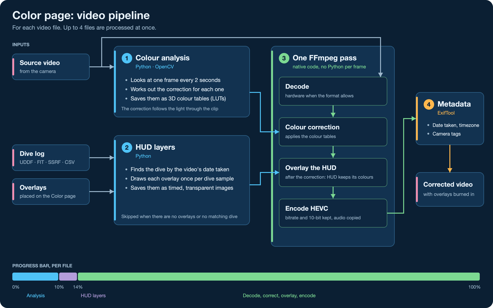
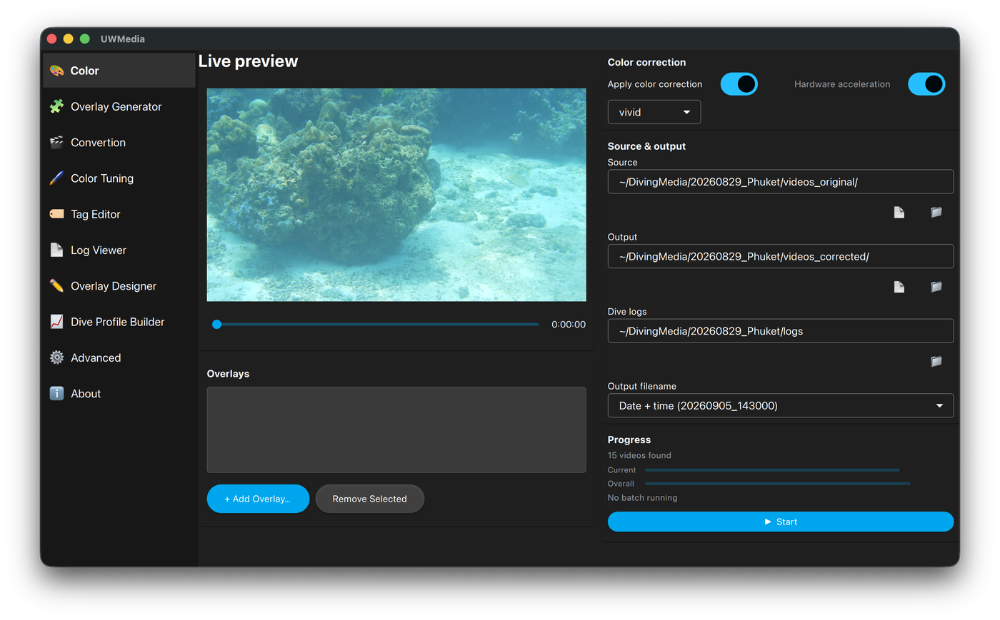

# UWMedia (Underwater Media Processor)

<p align="center">
  <a href="https://skillicons.dev">
    
  </a>
</p>

<p align="center">
      
      
    </p>


UWMedia is a tool for processing underwater videos and photos. It can use telemetry information from dive computers to generate an overlay on photos and videos. There is also support for color correction so you don't have to do every photo / video one by one.

When i started the project 2025 I wanted the overlay data from the dive computer on my videos. At the same time I added a basic color correction but it wasn't very good.
Since then I started to use Gemini and Antigravity to be able to test alternative solutions and get a better color correction.

Example of Photo before and after


Photo with Telemetry data (old overlay)


## [Example (YouTube)](https://youtu.be/8r8_4H4iOMg) (will be updated)

## Key Features

- **Batch Processing**: Process entire directories of videos and photos in one command.
- **Fast 3D LUT Color Pipeline**: Dynamic 3D LUT (`.cube`) generation from profile settings, executing color correction natively in FFmpeg to bypass Python overhead and speed up vs processing frame by frame.
- **Advanced Color Correction**: Underwater color restoration with custom profiles (vivid, subtle, default) saved in `color.yaml`.
- **Telemetry Overlay (HUD)**: Synchronize dive logs from Garmin (.FIT), Subsurface (.XML), and Shearwater (.UDDF) to create dynamic telemetry overlays.
- **Batch Telemetry Overlays (`--render-video-log`)**: Automatically generate matching black-background overlay videos/photos for all raw files in a folder, preserving creation timestamps and duration. Rendered at the template's 1080p size, at 2× for 4K footage, or as a full 1920×1080 / 3840×2160 frame with the overlay already in place (`--overlay-size`, `--overlay-full-frame`); the Overlay Generator page shows progress per overlay and for the whole batch.
- **Metadata Integrity**: Preserves original camera metadata (QuickTime, DJI, Sony) and injects correct timezone/location information.
- **Dynamic Naming**: Automatically rename files based on the "Date Taken" metadata (`YYYYMMDD_HHMMSS`).
- **Overlay Templates & Designer**: Built-in overlay templates per dive computer (Garmin x50i/mk3i, Shearwater Perdix 2/3, Petrel, Peregrine, Teric, Tern, generic) with live state badges, colour rules and each brand's own ascent-rate arrows, plus a full designer to modify them or build your own from any background image - readouts with small decimals or seconds as on the real screens, vertical labels, and adjustable colour and opacity for every shaded area of the dive-profile graph.
- **Log-to-Video Generation**: Create HEVC telemetry-only videos directly from dive logs on a black background - for a dive with no footage, e.g. one built in the Dive Profile Builder - at the same 1080p / 4K / full-frame sizes.
- **Overlays keep their colours**: when overlays are burned in with colour correction, the correction applies to the footage only; the dive computer's bezel and text come out exactly as designed.
- **Layout Validation**: Automatic verification of HUD layouts against loaded dive logs to prevent errors during processing.
- **Dive Profile Builder**: Draw a synthetic open circuit, sidemount or CCR dive and save it as a UDDF, Garmin FIT or Subsurface log, to test overlays in situations like deco or gas switches. *Test data only - not for dive planning.*

<p align="center">
  
</p>

### Workflow (how I do)
- **Run Color Correction** for all videos and photos.
- **Telemetry Creation**: for each corrected video, generate matching overlays (often several versions).
- **Import** videos and overlays into one folder in the video editor (I use Final Cut Pro).
- **Synchronized Clip**: create a sync clip per video and pick the overlay for it.
- **Create the Video** as normal - with the overlay as a separate layer, things like stabilisation are easy.

More detail in [Getting started → Typical workflow](docs/getting-started.md#typical-workflow).

## Installation

Download the app from the [Releases](../../releases) page (Windows/macOS/Linux), or run from source (Python 3.10+, FFmpeg and ExifTool in your `PATH`):

```bash
git clone https://github.com/MickeMannen/UWMedia.git
cd UWMedia
pip install -r requirements.txt
python -m uwmedia          # desktop app
python cli_main.py --help  # command line
```

See [Getting started](docs/getting-started.md) for the macOS download options and where your files are stored, and [Building the app](docs/building.md) to package it yourself.

## Documentation

The full documentation is in [`docs/`](docs/README.md):

| | |
|---|---|
| **The app** | [Color](docs/color.md) · [Overlay Generator](docs/overlay-generator.md) · [Convertion](docs/convertion.md) · [Color Tuning](docs/color-tuning.md) · [Tag Editor](docs/tag-editor.md) · [Log Viewer](docs/log-viewer.md) · [Overlay Designer](docs/overlay-designer.md) · [Dive Profile Builder](docs/dive-profile-builder.md) · [Advanced](docs/advanced.md) |
| **Reference** | [Command line](docs/cli.md) · [Configuration files](docs/configuration.md) · [Building](docs/building.md) · [How it works](docs/technical.md) |

<p align="center">
  
</p>

Quick CLI examples - colour-correct a folder and add a telemetry overlay, or
render separate 4K overlay videos to layer in your editor:

```bash
python cli_main.py ./raw/ ./out/ --logs ./dive_logs/ --layout skins/perdix.zip --color
python cli_main.py ./raw/ ./overlays/ --logs ./dive_logs/ --layout skins/perdix.zip --render-video-log --overlay-size 4k
```

Please share if you make a fancy overlay!

## License

[MIT License](LICENSE)

## Credits
- Color Algorithm: [bornfree](https://github.com/bornfree) - This is not used anymore but gave me the idea!
- Metadata: [ExifTool by Phil Harvey](https://exiftool.org/)
- Processing: [FFmpeg](https://ffmpeg.org/)
