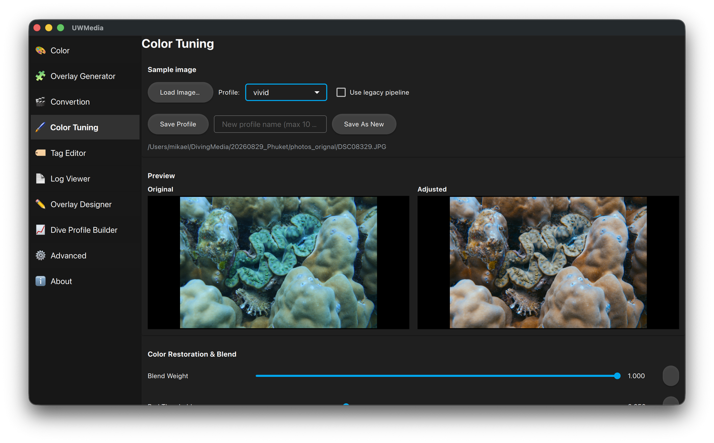

# Color Tuning

Tune a colour-correction profile on a sample image, with the **Original** and
**Adjusted** versions side by side, and save it for the [Color](color.md)
page and the CLI's `--color` option.

  

## Using it

1. **Load Image…** a typical photo or video frame from the dive.
2. Pick the **Profile** to start from.
3. Move the sliders - the Adjusted preview updates as you go. Each slider can
   be reset to its default.
4. **Save Profile** writes the changes back to the selected profile;
   **Save As New** saves them under a new name (max 10 characters).

Profiles are saved to your own `color.yaml` in the app's data folder (see
[Getting started](getting-started.md#where-your-files-live)); the bundled
profiles are never overwritten.

**Use legacy pipeline** previews with the older colour-restoration method
instead of the current one.

## The sliders

| Group | Sliders | What it does |
|---|---|---|
| Color Restoration & Blend | Blend Weight, Red/Blue Threshold, Red/Blue Scale | How strongly lost red is restored and blue is reduced, and how much of the correction is blended in. |
| Black Point Floors | CDF Cutoff Floor | How much of the darkest end is clipped to black. |
| Gray World White Balance | Mask Multiplier, Mask Fallback Weight, Gaussian Blur Radius/Sigma, Isolation Variation/Min Sum | White balance that assumes the scene averages to grey, ignoring areas that would skew it. |
| De-haze Adjustment | Saturation Cutoff/Divisor, Dehaze Min/Max Bound | Removes the washed-out haze of water between camera and subject. |
| Exposure Normalization | CDF Brightness Cutoff, Target Reference Brightness, Exposure Min/Max Mult | Brightens dark footage towards a target level, within limits. |
| OKLCh Blue Hue Translation | Min/Max Hue Scanning Bin, Scan Decay Weight, Fallback Blue Hue | Finds the dominant water blue and shifts it to a more natural hue. |
| Final Adjustments | Sharpness, Darkness | Final sharpening and overall brightness. |

The same values can be edited by hand in `color.yaml` - see
[Configuration files](configuration.md#coloryaml).
