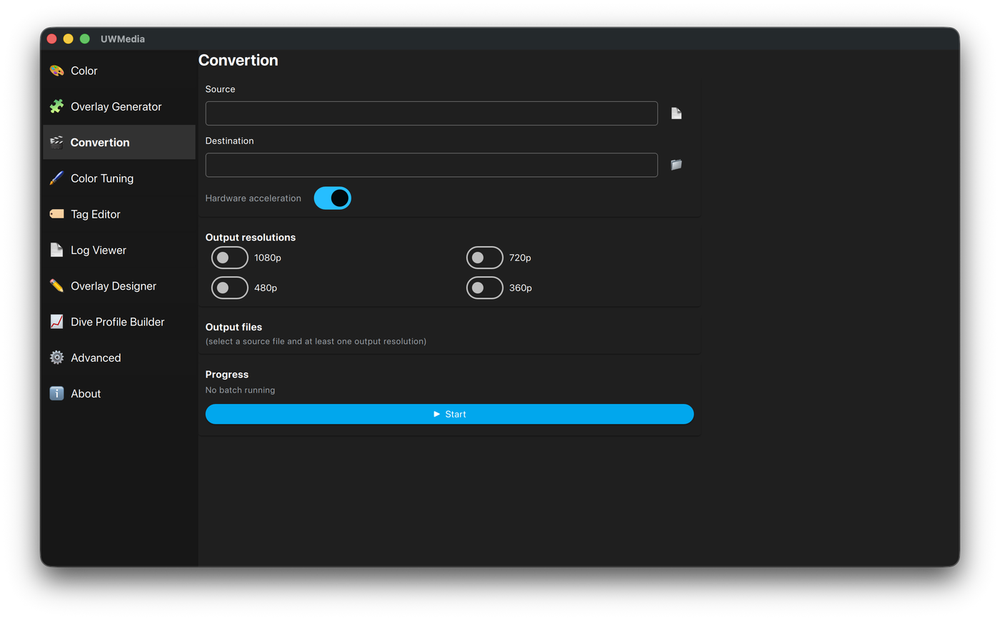

# Convertion

Re-encodes a video (or a folder of videos) to one or more smaller
resolutions - handy for proxies or sharing.

  

## Using it

1. Pick the **Source** (file or folder) and the **Destination** folder.
2. Tick one or more **Output resolutions**: 1080p, 720p, 480p, 360p.
3. **Output files** lists the file names that will be created before you
   start.
4. **Hardware acceleration** uses the GPU encoder where available.
5. Press **▶ Start** (**■ Abort** stops it).

Only one batch job (Color, Overlay Generator or Convertion) can run at a time.

CLI equivalent: `python cli_main.py SRC OUT --convert 1080p 720p` - see [CLI](cli.md).
