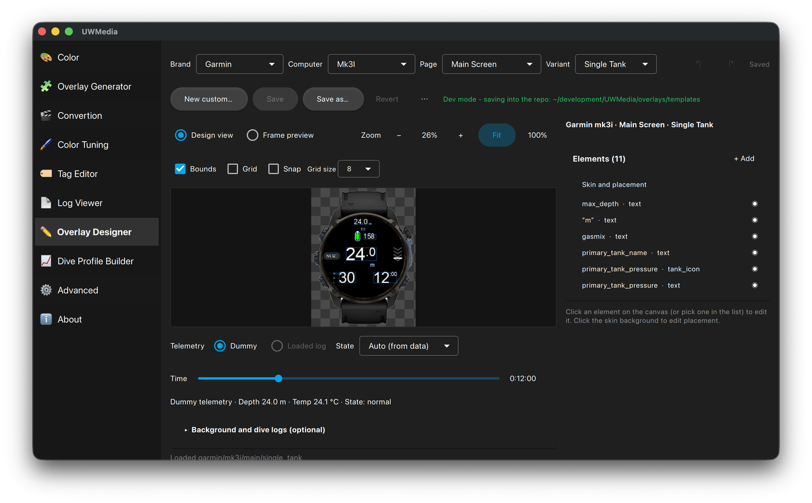

# Overlay Designer

Edit any built-in overlay template or build your own from a background
image.

<p align="center">
  
</p>

## Picking a template

Choose **Brand → Computer → Page** (and **Variant** where there is one).

The **Telemetry** source is either **Dummy** - a synthetic dive, the default,
so you need no video or dive log - or **Loaded log**. Optionally, under
**More → Background and dive logs…**:

- **Load video/photo** to design on top of real footage.
- **Select log directory** to drive the overlay from a real log. A log found
  there can be previewed directly, no video needed; **TZ offset** lines the
  log up with the media if their clocks differ.
- **Show raw waypoint data** lists the values of the current sample.

The **Time** slider moves through the dive and **State** forces a state (e.g.
deco, safety stop) so you can check how the overlay looks in it.

## Views

- **Design view** - the template at native pixels, for placing elements.
- **Frame preview** - the full 1920×1080 composite, the way it will be
  rendered. Here you can drag the whole skin into place.

**Zoom**, **Fit** and **100%** control the view; **Grid** with a **Grid size**
and **Snap** (to the grid and to other elements' edges) help alignment.

## Editing elements

- **+ Add** adds a telemetry field, a custom label, the state badge, tank
  icons or the depth graph. Depth and dive time come in two entries each:
  **depth** (plain, e.g. `12.3`) and **depth_small_decimals** - the metres
  large and the decimal part small and top-aligned; **dive_time** (e.g.
  `32:15`) and **dive_time_small_seconds** - the minutes large and the
  seconds small. That is the way Garmin and Shearwater computers show them.
  The small variants are ordinary depth / dive_time elements with the
  inspector's **Small suffix** style preset (*Decimals* / *Seconds*);
  **Suffix size** sets how small.
- Click an element on the canvas (or in the **Elements** list) to edit it in
  the inspector: font, size, bold, colour, outline, alignment, anchor, offsets,
  opacity - and element-specific settings such as tank segments, chevron counts
  or the depth graph's marker. The inspector is grouped into folding sections
  (Element, Position and size, Text, Tank icon, Tissue bar, Graph colours and
  shading, Graph options); click a heading to fold or open it. The
  **Elements** heading folds the list the same way, showing the selected
  element's name while folded. The right-hand column scrolls.
- **Ascent chevrons** follow the template's brand rules: Garmin gets chevrons
  over a divider bar (green / yellow / red, the lower one lit on descent),
  Shearwater six arrows and no bar - white under 9 m/min, yellow to 18,
  flashing red above, one arrow per 3 m/min as in the Perdix 2 manual. **Up**,
  **Down** and **Divider bar** in the inspector override the brand defaults.
- **Orientation** (text elements and custom labels): **H** horizontal, **S**
  stacked - upright letters one under the other - or turned on its side,
  **↑** reading bottom-to-top or **↓** top-to-bottom. Align / V-align then
  place the vertical box on the anchor. A small-suffix style is not applied
  to vertical text.
- Drag to move, arrow keys to nudge, **+** / **−** to grow or shrink by 5 %.
- **Align** and **Distribute** line up several selected elements; **Align**
  moves the others onto the last-clicked one.
- Order with bring forward / send backward (Cmd/Ctrl-] / [), duplicate with
  Cmd/Ctrl-D, delete with Delete.
- **Undo** / **Redo** (Cmd/Ctrl-Z, Shift-Cmd/Ctrl-Z).
- Click the skin background to edit its **placement** (anchor, offsets,
  scale); **Replace image…** swaps the background image.

### Depth graph

The depth graph plots the whole dive with a cursor at the current moment. By
default it shades one grey band from the surface to the logged deco stop
depth. In the inspector:

| Option | What it does |
|---|---|
| **Color** / **Ceiling** | Profile line colour; ceiling (or, without *Deco stops*, the stop band) colour. |
| **Box**, **Box opacity** | The graph's background box (and its thin border in the line colour): colour and strength, 0 to 1. Default black at 0.4 - what darkens the profile on footage. |
| **Fill**, **Fill opacity**, **Ceiling opacity**, **Stops opacity** | Colour of the area under the profile line (the line colour unless set) and how strong each shaded area is, 0 (invisible) to 1 (solid). The defaults - fill 0.15, ceiling 0.4 (band 0.45), stops 0.5 - read strong once the overlay sits on footage; lower them here. |
| **Deco stops** | Shades the deco stops (a step area from the surface down to each logged stop level, in **Stops** colour) and the deco ceiling (a smooth area, in *Ceiling* colour) separately, for the whole dive. The ceiling isn't in dive logs - UWMedia recomputes it (Bühlmann, GF high) when it reads the log. |
| **Reveal profile over time** | Draws the depth line, and the deco shading, only up to the current moment, so the dive draws itself as the video plays and each stop appears as the dive reaches it (and stays after it clears). The axes still cover the whole dive. |
| **Stop label** | The current stop next to the cursor, e.g. `STOP 6m 2:00`, at the given **Size**; nothing out of deco. |

The **Generic → Dive Profile Deco** template has *Deco stops* and *Stop
label* on and *Reveal profile* off: the whole dive with its stops is on the
graph from the first frame and only the cursor moves, as in the plain Dive
Profile. See it with a deco log from the
[Dive Profile Builder](dive-profile-builder.md).

## Saving

- Built-in templates are read-only in the installed app. **Save as…** copies
  the page into one you own - under the same computer (so it keeps that
  computer's colour and warning rules from `hud_rules.json`), another computer,
  or a new *Custom* computer.
- **Save** stores changes to a template you own; **Revert** goes back to the
  last saved version. Switching template with unsaved changes asks first.
- **New custom…** starts an empty page from your own background image (a
  dive-computer screenshot, a HUD graphic, a transparent PNG) or a plain
  rounded shape.
- **Export page as zip…** / **Import page from zip…** share a page with
  someone else.

Your templates are stored in the app's data folder:
`templates/<brand>/<computer>/<page>/normal.json` + `normal.png` (the folder
can be changed under [Advanced](advanced.md)). They appear in the
[Overlay Generator](overlay-generator.md) and in Color's *Add Overlay* picker
straight away, marked "· yours", and the CLI renders them with
`--layout <that folder>/normal.json`.

### Pages with tank variants

A page that comes in a *single tank* and a *sidemount* variant (the Garmin
x50i and Mk3i and the Shearwater Perdix 2 and Petrel main pages) keeps one shared layout, `main/normal.json` with
the skin `normal.png`, and a small file per variant that only adds what
differs, normally the tank names, icons and pressures:

```
main/normal.json               shared elements, skin, colours
main/single_tank/normal.json   {"base": "../normal.json", "linked_elements": [one tank]}
main/sidemount/normal.json     {"base": "../normal.json", "linked_elements": [two tanks]}
```

Editing either variant in the designer edits the shared part for both:
move the depth or the stop box in *sidemount* and *single tank* follows.
Tank elements, and any element you add while editing a variant, belong to
that variant only. A variant file may also carry `overrides` (per-element
values that differ from the base, by the element's `id`) and `remove` (base
elements it leaves out); deleting a shared element in one variant records it
there rather than changing the base. **Save as…** and the zip export always
write a complete, self-contained page.

When running from a source checkout, saves go into the repo's
`overlays/templates/` (that's how the built-in templates are made); set
`UWMEDIA_TEMPLATES_TARGET=user` to use the per-user folder instead.

Please share if you make a fancy overlay!
