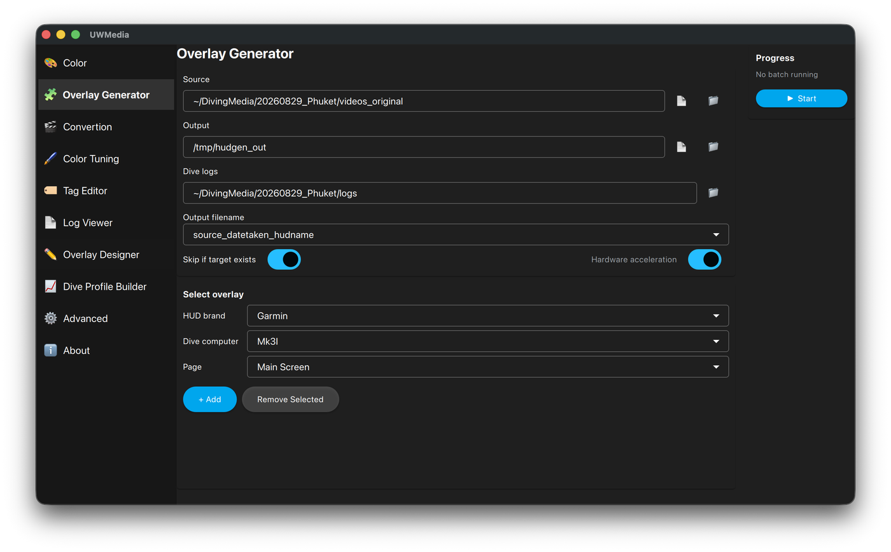

# Overlay Generator

Batch-renders **telemetry-only** overlays - black background, sized to the
template - for every video and photo in a folder. Each file is matched to its
dive by time, and the overlay has the same start time and duration as the
footage, ready to sync in your video editor.

  

## Using it

1. Pick the **Source** folder (your videos/photos), the **Output** folder and
   the **Dive logs** folder.
2. **Select overlay** - choose **HUD brand → Dive computer → Page** and press
   **+ Add**. Add as many overlays as you want; each one is rendered for every
   file. To use a template JSON from anywhere on disk, pick **Custom…** as the
   brand and enter its **Custom path**.
   Templates you made in the [Overlay Designer](overlay-designer.md) are
   listed as "· yours".
3. **Output filename** - either the source file name plus the overlay name, or
   the date taken plus the overlay name.
4. **Skip if target exists** skips files already rendered, so an interrupted
   batch can be resumed.
5. **Hardware acceleration** uses the GPU encoder where available.
6. Press **▶ Start** (**■ Abort** stops it).

Only one batch job (Color, Overlay Generator or Convertion) can run at a time.

## Tips

- Overlays are matched by the media's date taken, so it has to be right -
  including the timezone. Fix it in the [Tag Editor](tag-editor.md) first if
  the camera clock was off.
- No real dive with the situation you want to show (deco, gas switches…)?
  Make one in the [Dive Profile Builder](dive-profile-builder.md).
- CLI equivalent: `--render-video-log` (whole folder) or `--render-log`
  (one log, no media) - see [CLI](cli.md).
