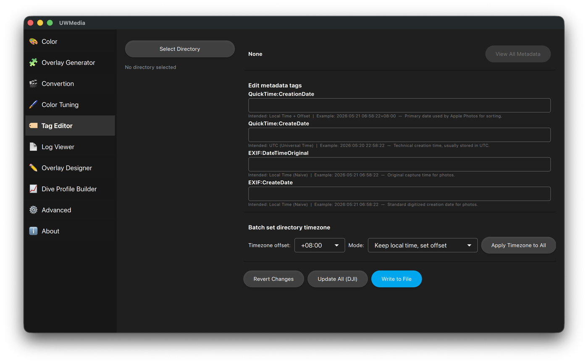

# Tag Editor

View and edit the date/timezone metadata (EXIF / QuickTime) of every photo
and video in a folder. Overlays are matched to dives by the time a file was
taken, so this is where you fix a camera clock that was wrong or set to the
wrong timezone.

  

## Using it

1. **Select Directory** - the files are listed; click one to see its tags.
2. Edit the date/time tags in **Edit metadata tags**. **Filter** narrows the
   list by tag name or value.
3. **Write to File** saves the changes; **Revert Changes** throws them away.
4. **View All Metadata** shows every tag ExifTool can read from the file.

## Timezones for a whole folder

**Batch set directory timezone** sets the timezone offset of every file at
once. Pick the **Timezone offset** and a **Mode**:

- **Keep local time, set offset** - the clock time stays the same; only the
  offset is changed. Use this when the camera showed the right local time.
- **Recalculate local time from UTC** - the UTC time stays the same and the
  local time is recalculated for the new offset. Use this when the camera
  recorded the correct moment but in the wrong timezone.

Then press **Apply Timezone to All**.

## DJI files

DJI cameras don't store the local time reliably. When a DJI file is detected,
the correct values are calculated from the original file path, and
**Update All (DJI)** applies them to every file.

CLI equivalents: `--force-media-tz`, `--fix-tz`, `--modify-quicktime` - see [CLI](cli.md).
